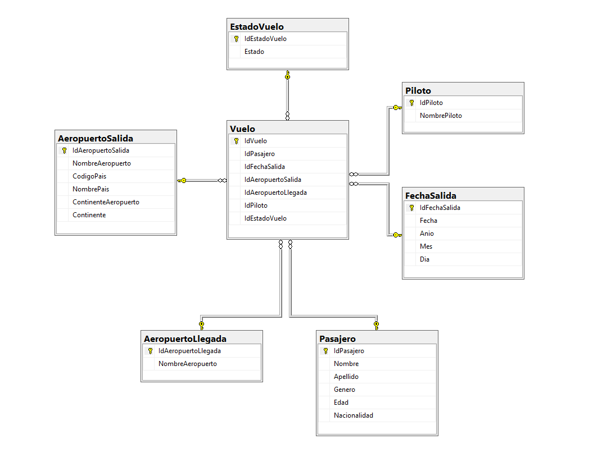

**<h1 align="center">Seminario de Sistemas 2</h1>**

<div>🏛 Universidad San Carlos de Guatemala</div>
<!-- <div>📕 Arquitectura De Computadoras y Ensambladores 2</div> -->
<div>📆 Primer Semestre 2025</div>
<div>🙍‍♂️ Brandon Andy Jefferson Tejaxún Pichiyá 🆔 202112030</div>

## **Diagrama Entidad Relación**

La tabla principal del modelo es **Vuelos**, que centraliza las relaciones con las demás entidades. Cada Vuelo está relacionado con un **Pasajero**, para poder tener un seguimiento individual de pasajeros en lugar de vuelos con múltiples pasajeros.

La tabla **FechaSalida** desglosa la fecha de sus componentes para tener mayor facilidad de realizar consultas basadas en el tiempo. Las relaciones con **AeropuertoSalida** y **AeropuertoLlegada** permite registrar el origen y destino de cada vuelo.

Cada vuelo operado por un piloto por el cual se requiere tener una relación con la tabla **Piloto** . También se incluye la tabla de **EstadoVuelo** para permitir un seguimiento de su situación en tiempo real.



## **Funciones de Transformación**

Dependencias

pandas

Funciones

1. passenger_cleaned(df)

Propósito: Elimina duplicados y valores nulos en la tabla de pasajeros.

Elimina duplicados por Passenger ID.

Elimina filas con valores nulos en las columnas clave.

Renombra las columnas para coincidir con la base de datos.

```py
def passenger_cleaned(df):
    try:
        passenger_cleaned = df.drop_duplicates(subset=['Passenger ID'])
        passenger_cleaned = passenger_cleaned.dropna(subset=['Passenger ID', 'First Name', 'Last Name', 'Gender', 'Age', 'Nationality'])

        passenger_cleaned = passenger_cleaned.rename(columns={
            'Passenger ID': 'IdPasajero',
            'First Name': 'Nombre',
            'Last Name': 'Apellido',
            'Gender': 'Genero',
            'Age': 'Edad',
            'Nationality': 'Nacionalidad'
        })
        return passenger_cleaned
    except Exception as e:
        print(f"Error al transformar los datos: {e}")
        return None
```

2. data_cleaned(df)

Propósito: Limpia y estructura los datos de fechas de salida.

Elimina duplicados por Departure Date.

Convierte Departure Date a formato de fecha.

Extrae año, mes y día en columnas separadas.

```py
def data_cleaned(df):
    try:
        df_cleaned = df.drop_duplicates(subset=['Departure Date'])
        df_cleaned = df_cleaned.dropna(subset=['Departure Date'])

        df_cleaned['Departure Date'] = pd.to_datetime(df_cleaned['Departure Date'], errors='coerce')

        df_cleaned = df_cleaned.dropna(subset=['Departure Date'])

        df_cleaned['Anio'] = df_cleaned['Departure Date'].dt.year
        df_cleaned['Mes'] = df_cleaned['Departure Date'].dt.month
        df_cleaned['Dia'] = df_cleaned['Departure Date'].dt.day
        return df_cleaned
    except Exception as e:
        print(f"Error al transformar los datos: {e}")
        return None
```

3. airportS_cleaned(df)

Propósito: Limpia datos de aeropuertos de salida.

Elimina duplicados por Airport Name.

Elimina filas con valores nulos.

Normaliza los valores eliminando espacios en blanco.

```py
def airportS_cleaned(df):
    try:
        df_cleaned = df.drop_duplicates(subset=['Airport Name'])
        df_cleaned = df_cleaned.dropna(subset=['Airport Name', 'Airport Country Code', 'Country Name', 'Airport Continent', 'Continents'])

        columns_to_strip = ['Airport Name', 'Airport Country Code', 'Country Name', 'Airport Continent', 'Continents']
        df_cleaned[columns_to_strip] = df_cleaned[columns_to_strip].apply(lambda x: x.str.strip())
        return df_cleaned
    except Exception as e:
        print(f"Error al transformar los datos: {e}")
        return None
```

4. arrivalA_cleaned(df)

Propósito: Limpia datos de aeropuertos de llegada.

Elimina duplicados y valores nulos.

Normaliza eliminando espacios en blanco.

```py
def arrivalA_cleaned(df):
    try:
        df_cleaned = df.drop_duplicates(subset=['Arrival Airport']).dropna(subset=['Arrival Airport'])

        df_cleaned['Arrival Airport'] = df_cleaned['Arrival Airport'].str.strip()
        return df_cleaned
    except Exception as e:
        print(f"Error al transformar los datos: {e}")
        return None
```

5. pilot_cleaned(df)

Propósito: Limpia datos de pilotos.

Elimina duplicados y valores nulos.

Normaliza eliminando espacios en blanco.

```py
def pilot_cleaned(df):
    try:
        df_cleaned = df.drop_duplicates(subset=['Pilot Name']).dropna(subset=['Pilot Name'])
        df_cleaned['Pilot Name'] = df_cleaned['Pilot Name'].str.strip()
        return df_cleaned
    except Exception as e:
        print(f"Error al transformar los datos: {e}")
        return None
```

6. flightS_cleaned(df)

Propósito: Limpia datos del estado de los vuelos.

Elimina duplicados y valores nulos.

Normaliza eliminando espacios en blanco.

```py
def flightS_cleaned(df):
    try:
        df_cleaned = df.drop_duplicates(subset=['Flight Status']).dropna(subset=['Flight Status'])

        df_cleaned['Flight Status'] = df_cleaned['Flight Status'].str.strip()

        return df_cleaned
    except Exception as e:
        print(f"Error al transformar los datos: {e}")
        return None
```

7. flight_cleaned(df)

Propósito: Limpia datos de vuelos.

Elimina duplicados.

Convierte Departure Date a formato de fecha.

```py
def flight_cleaned(df):
    try:
        df_cleaned = df.drop_duplicates(subset=['Passenger ID', 'Departure Date', 'Airport Name', 'Arrival Airport', 'Pilot Name', 'Flight Status'])
        df_cleaned = df_cleaned.dropna(subset=['Passenger ID', 'Departure Date', 'Airport Name', 'Arrival Airport', 'Pilot Name', 'Flight Status'])

        df_cleaned['Departure Date'] = pd.to_datetime(df_cleaned['Departure Date'], errors='coerce').dt.date

        return df_cleaned
    except Exception as e:
        print(f"Error al transformar los datos: {e}")
        return None
```

## **Funcion de Carga**

Dependencias

pyodbc (para la conexión con bases de datos SQL)

Funciones

1. load_data_to_db(...)

Propósito: Carga los datos transformados en la base de datos.

* Usa MERGE para evitar duplicados.
* Inserta en las tablas:
* Pasajero
* FechaSalida
* AeropuertoSalida
* AeropuertoLlegada
* PilotosTemp (tabla temporal para optimizar la inserción de pilotos)

Optimizaciones:
* Uso de fast_executemany para inserciones masivas.
* Uso de MERGE en SQL para evitar registros duplicados.


```py
def load_data_to_db(df_cleaned, data_tranformed, airportS_tranformed, arrivalA_tranformed, pilot_tranformed, flightS_tranformed, flight_transformed, connection):
    try:
        cursor = connection.cursor()
        cursor.fast_executemany = True

        merge_query = """
            MERGE INTO Pasajero AS target
            USING (VALUES (?, ?, ?, ?, ?, ?)) AS source (IdPasajero, Nombre, Apellido, Genero, Edad, Nacionalidad)
            ON target.IdPasajero = source.IdPasajero
            WHEN NOT MATCHED BY TARGET THEN
                INSERT (IdPasajero, Nombre, Apellido, Genero, Edad, Nacionalidad)
                VALUES (source.IdPasajero, source.Nombre, source.Apellido, source.Genero, source.Edad, source.Nacionalidad);
        """

        # preparar insert masivo
        data_to_insert = []
        for index, row in df_cleaned.iterrows():
            data_to_insert.append((row['IdPasajero'], row['Nombre'], row['Apellido'], row['Genero'], row['Edad'], row['Nacionalidad']))

        cursor.fast_executemany = True  # a echar punta
        cursor.executemany(merge_query, data_to_insert)
        connection.commit()
        print("✅ Pasajeros insertados correctamente.")

        # ===============================

        merge_query = """
            MERGE INTO FechaSalida AS target
            USING (VALUES (?, ?, ?, ?)) AS source (Fecha, Anio, Mes, Dia)
            ON target.Fecha = source.Fecha
            WHEN NOT MATCHED BY TARGET THEN
                INSERT (Fecha, Anio, Mes, Dia)
                VALUES (source.Fecha, source.Anio, source.Mes, source.Dia);
        """

        # preparar insert masivo
        data_to_insert = []
        for index, row in data_tranformed.iterrows():
            data_to_insert.append((row['Departure Date'].date(), row['Anio'], row['Mes'], row['Dia']))

        cursor.fast_executemany = True  # a echar punta
        cursor.executemany(merge_query, data_to_insert)
        connection.commit()

        print("✅ Fechas de salida insertadas correctamente.")
```